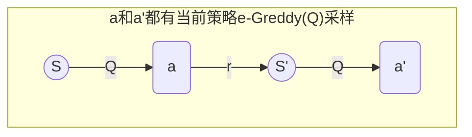
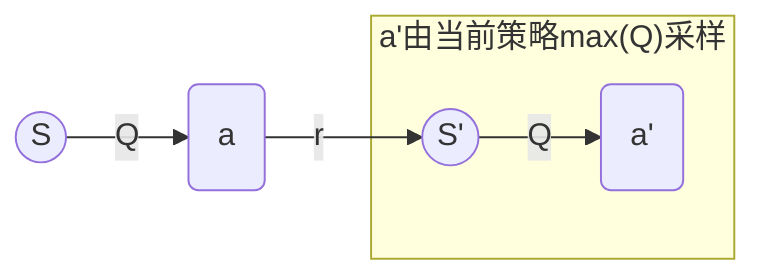

时序差分是一种用来估计一个策略的价值函数的方法，它结合了蒙特卡洛和动态规划算法的思想。时序差分方法和蒙特卡洛的相似之处在于可以从样本数据中学习，不需要事先知道环境；和动态规划的相似之处在于根据贝尔曼方程的思想，利用后续状态的价值估计来更新当前状态的价值估计。

$$
V(s_t) \leftarrow V(s_t)+\alpha[r_t+\gamma V(s_{t+1})-V(s_t)]
$$

其中$R_t+\gamma V(s_{t+1})-V(s_t)$被称为**时序差分**（temporal difference，TD或**误差**（error）

# Sarsa算法

基于策略迭代的**同策略**算法

$$
Q(s_t,a_t)\leftarrow Q(s_t,a_t)+\alpha[r_t+\gamma Q(s_{t+1},a_{t+1})-Q(s_t,a_t)]
$$

其中：

- $\alpha$是学习率
- $\gamma$折扣因子
  每次迭代$(s,a,r,s',a')$

##### $\epsilon$-贪婪策略

如果在策略提升中一直根据贪婪算法得到一个确定性策略，可能会导致某些状态动作对$(s,a)$永远没有在序列中出现，以至于无法对其动作价值进行估计，进而无法保证策略提升后的策略比之前的好。公式表示为：

$$
\pi(a|s)=\begin{cases}
\epsilon/|\mathcal A|+1-\epsilon & \text{if}\ a=\arg\max_{a'}Q(s,a') \\
\epsilon/|\mathcal A| & \text{else}
\end{cases}
$$

有$1-\epsilon$的概率选择概率最大的动作

### 迭代步骤

整个步骤为：

1. 初始化Q为 状态数\*行动数量的表
2. 迭代N步
   1. 用$\epsilon$-贪婪策略根据Q表选择当前状态$s$下的动作$a$
   2. 进行迭代$t=1 \rightarrow \infty$直到环境允许后退出：
      1. 获取环境得到的反馈奖励$r$,下一步状态$s'$
      2. 用$\epsilon$-贪婪策略根据Q表选择当前状态$s'$下的动作$a'$
      3. 迭代入Q表：$Q(s_t,a_t)\leftarrow Q(s_t,a_t)+\alpha[r_t+\gamma Q(s_{t+1},a_{t+1})-Q(s_t,a_t)]$
      4. $s\leftarrow s'$,$a\leftarrow a'$

# n步Sarsa

相比于传统Sarsa，多步时序差分的意思是使用步的奖励，然后使用之后状态的价值估计
仅仅替换了上一状态的价值函数

$$
Q(s_t,a_t)\leftarrow Q(s_t,a_t)+\alpha[r_t+\gamma r_{t+1}+\cdots+\gamma^{n -1}r_{t+n-1}+\gamma^nQ(s_{t+n},a_{t+n})-Q(s_t,a_t)]
$$

参与差分的上一状态价值为$G_t=r_t+\gamma r_{t+1}+\cdots+\gamma^{n -1}r_{t+n-1}+\gamma^nQ(s_{t+n},a_{t+n})$
**_注意：_** 该时间迭代t仅在大于等于n步后才会更新Q表

# Q-learning

值迭代的**异策略**
行为策略与目标策略（更新策略）不同

$$
Q(s_t,a_t)\leftarrow Q(s_t,a_t)+\alpha[r_t+\gamma \max_a Q(s_{t+1},a_{t+1})-Q(s_t,a_t)]
$$

基本算法思路与**_Sarsa_**一致仅仅改变了上一状态价值为$G_t=r_t+\gamma \max_a Q(s_{t+1},a_{t+1})$

### 迭代步骤

整个步骤为：

1. 初始化Q为 状态数\*行动数量的表
2. 迭代N步
   1. 获得初始状态$s$
   2. 进行迭代$t=1 \rightarrow \infty$直到环境允许后退出：
      1. 用$\epsilon$-贪婪策略根据Q表选择当前状态$s$下的动作$a$
      2. 获取环境得到的反馈奖励$r$,下一步状态$s'$
      3. 迭代入Q表：$Q(s,a)\leftarrow Q(s,a)+\alpha[r+\gamma \max_{a'} Q(s',a')-Q(s,a)]$
      4. $s\leftarrow s'$

##### 在更新参数上的不同

**_Sarsa_**

**_Q-learning_**

与**_Sarsa_**不同：

- **_Sarsa_**采用当前采样的五元组$(s,a,r,s',a')$属于在线测量学习方法
- **_Q-learning_**，它的更新公式使用的是四元组$(s,a,r,s')$,并不需要一定是当前策略采样得到的数据，也可以来自行为策略，因此它是离线策略算法。

### TD与MC的异同

TD是低方差、有偏估计
MC是高方差、无偏估计

都遵循**GPI（广义值迭代）**
评估的目标都是状态-动作对的最有动作值函数。
